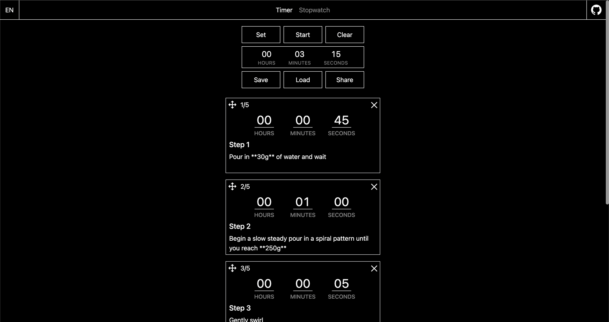

# J.A.T - Just another timer

J.A.T is my attempt at creating a timer. The timer is made of sequentially running steps. Aside from the duration, each step contains two optional fields: title (text) and description (markdown). The timer's state is saved between browser sessions. It is also possible to share it through a link or save it manually to the browser’s localStorage. The app also includes a simple stopwatch.

[Open J.A.T](https://www.justanothertimer.com)
